# Architectural Roadmap: Dental Management System → Full-Stack Application

## 1. Current State Analysis

```mermaid
graph LR
    A[React 19.1.0 Frontend] --> B[Tauri 2.x Shell]
    B --> C[Rust Backend]
    C --> D[1 greet() command]
    A --> E[Mock Data in Constants]
    E --> F[~40 hardcoded patients]
    E --> G[Procedures list]
```

**Frontend**: React 19.1.0, TypeScript, Vite 7.0.4, Tailwind CSS, ShadCN/Radix UI, react-i18next (EN/PS with RTL), react-router-dom 7.17.0, date-fns, Sonner toasts, dental chart SVG component.

**Domain modules**: Dashboard, Patients (with table, search, filters, pagination, dental chart), New Patient form (medical history, clinical notes, X-ray upload, tooth charting), Billing (stub), Reports (stub), Settings, About/Help.

**Backend**: Tauri v2 with a single `greet()` Rust command — no database, no real API layer, no persistence.

**Data layer**: None. All data is mock: `src/shared/constants/PatientsData.ts` (~40 patients), `Procedures.ts`.

---

## 2. Recommended Architecture Stack

```
┌─────────────────────────────────────────────────────────────────┐
│                      FRONTEND (unchanged)                        │
│   React 19 │ TS │ Tailwind 4 │ ShadCN │ react-router │ i18next   │
└──────────────────────────┬──────────────────────────────────────┘
                           │ Tauri IPC / REST HTTP
┌──────────────────────────▼──────────────────────────────────────┐
│               TAURI v2 APPLICATION SHELL                          │
│  ┌─────────────────────────────────────────────────────────────┐│
│  │                   RUST BACKEND SERVICE                       ││
│  │  ┌───────────┐  ┌────────────┐  ┌────────────────────────┐ ││
│  │  │ Tauri     │  │  Axum      │  │ SQLx (SQLite)          │ ││
│  │  │ Commands  │  │  HTTP API  │  │ Database Layer         │ ││
│  │  │ (native)  │  │ (optional) │  │                        │ ││
│  │  └─────┬─────┘  └─────┬──────┘  └───────────┬────────────┘ ││
│  │        │               │                      │              ││
│  │        ▼               ▼                      ▼              ││
│  │  ┌─────────────────────────────────────────────────────────┐││
│  │  │           DOMAIN / APPLICATION SERVICES                  │││
│  │  │  PatientService │ AppointmentService │ BillingService   │││
│  │  │  ReportingSvc   │ AuthService       │ SettingsService  │││
│  │  └─────────────────────────────────────────────────────────┘││
│  └─────────────────────────────────────────────────────────────┘│
└──────────────────────────┬──────────────────────────────────────┘
                           │
┌──────────────────────────▼──────────────────────────────────────┐
│              SQLite Database (app-local file)                     │
│         via SQLx with migrations / SeaORM entities               │
└──────────────────────────────────────────────────────────────────┘
```

---

## 3. Database Layer — SQLite via SQLx

### Why SQLite + SQLx over alternatives

| Decision | Rationale |
|---|---|
| **SQLite** (not Postgres/MySQL) | Tauri apps ship a single binary; no external DB server needed. Schema lives in `src-tauri/migrations/`. |
| **SQLx over Diesel/SeaORM** | SQLx is compile-time checked (SQL files verified at build), no codegen step, lightweight, idiomatic Rust, async-first via `sqlx::query!`. |
| **Keep it embedded** | Dental clinics run on a single PC. Cloud sync can be layered later via a REST API. |

### Recommended schema (SQL)

```sql
-- src-tauri/migrations/001_init.sql

CREATE TABLE IF NOT EXISTS patients (
    id TEXT PRIMARY KEY,
    full_name TEXT NOT NULL,
    phone TEXT NOT NULL,
    age INTEGER NOT NULL CHECK (age > 0 AND age <= 120),
    gender TEXT CHECK(gender IN ('Male','Female','Other')),
    address TEXT,
    is_complete_profile BOOLEAN DEFAULT FALSE,
    created_at TEXT NOT NULL DEFAULT (datetime('now')),
    updated_at TEXT NOT NULL DEFAULT (datetime('now'))
);

CREATE TABLE IF NOT EXISTS patient_medical_info (
    patient_id TEXT PRIMARY KEY REFERENCES patients(id) ON DELETE CASCADE,
    allergies TEXT DEFAULT '',
    medications TEXT DEFAULT '',
    clinical_notes TEXT DEFAULT '',
    created_at TEXT NOT NULL DEFAULT (datetime('now')),
    updated_at TEXT NOT NULL DEFAULT (datetime('now'))
);

CREATE TABLE IF NOT EXISTS medical_conditions (
    id INTEGER PRIMARY KEY AUTOINCREMENT,
    patient_id TEXT NOT NULL REFERENCES patients(id) ON DELETE CASCADE,
    condition_name TEXT NOT NULL, -- 'diabetes' | 'hypertension' | 'asthma' ...
    is_active BOOLEAN DEFAULT FALSE
);

CREATE TABLE IF NOT EXISTS procedures (
    id TEXT PRIMARY KEY,
    name TEXT NOT NULL,
    description TEXT,
    default_price  REAL NOT NULL CHECK (default_price >= 0),
    category TEXT DEFAULT 'General',
    is_active BOOLEAN NOT NULL DEFAULT TRUE,
    created_at TEXT NOT NULL DEFAULT (datetime('now')),
    updated_at TEXT NOT NULL DEFAULT (datetime('now'))
);

CREATE TABLE IF NOT EXISTS visits (
    id TEXT PRIMARY KEY,
    patient_id TEXT NOT NULL REFERENCES patients(id) ON DELETE CASCADE,
    visit_date TEXT NOT NULL DEFAULT (datetime('now')),
    chief_complaint TEXT DEFAULT '',
    clinical_notes TEXT DEFAULT '',
    status TEXT NOT NULL DEFAULT 'Open' CHECK(status IN ('Open','Completed','Cancelled')),
    created_at TEXT NOT NULL DEFAULT (datetime('now')),
    updated_at TEXT NOT NULL DEFAULT (datetime('now'))
);

CREATE TABLE IF NOT EXISTS treatment_records (
    id TEXT PRIMARY KEY,
    visit_id TEXT NOT NULL REFERENCES visits(id) ON DELETE CASCADE,
    procedure_id TEXT NOT NULL REFERENCES procedures(id),
    tooth_quadrant TEXT,
    quantity INTEGER NOT NULL DEFAULT 1, -- stores number of procedures performed
    procedure_price REAL NOT NULL,
    treatment_notes TEXT,
    performed_at TEXT NOT NULL DEFAULT (datetime('now'))
);

CREATE TABLE IF NOT EXISTS treatment_teeth (
    id INTEGER PRIMARY KEY AUTOINCREMENT,
    treatment_record_id TEXT NOT NULL REFERENCES treatment_records(id) ON DELETE CASCADE,
    tooth_number INTEGER
);

CREATE TABLE IF NOT EXISTS payments (
    id           TEXT PRIMARY KEY,
    invoice_id   TEXT NOT NULL REFERENCES invoices(id) ON DELETE CASCADE,
    amount       REAL NOT NULL,
    notes        TEXT DEFAULT '',
    received_at  TEXT NOT NULL DEFAULT (datetime('now'))
);

CREATE TABLE IF NOT EXISTS xrays (
    id TEXT PRIMARY KEY,
    patient_id TEXT NOT NULL REFERENCES patients(id) ON DELETE CASCADE,
    file_path TEXT NOT NULL,
    is_primary BOOLEAN DEFAULT FALSE,
    uploaded_at TEXT NOT NULL DEFAULT (datetime('now'))
);

CREATE TABLE IF NOT EXISTS invoices (
    id TEXT PRIMARY KEY,
    visit_id TEXT NOT NULL UNIQUE REFERENCES visits(id) ON DELETE CASCADE,
    invoice_number TEXT NOT NULL UNIQUE,
    subtotal REAL NOT NULL,
    discount REAL NOT NULL DEFAULT 0,
    total_amount REAL NOT NULL,
    paid_amount REAL NOT NULL DEFAULT 0,
    outstanding_amount REAL NOT NULL DEFAULT 0,
    status TEXT NOT NULL CHECK(status IN ('Unpaid','Partial','Paid')),
    issued_at TEXT NOT NULL DEFAULT (datetime('now'))
);

CREATE TABLE IF NOT EXISTS invoice_items (
    id INTEGER PRIMARY KEY AUTOINCREMENT,
    invoice_id TEXT NOT NULL REFERENCES invoices(id) ON DELETE CASCADE,
    treatment_record_id TEXT REFERENCES treatment_records(id),
    procedure_name TEXT NOT NULL,
    quantity INTEGER NOT NULL,
    unit_price REAL NOT NULL,
    total_price REAL NOT NULL
);

CREATE TABLE IF NOT EXISTS app_settings (
    id INTEGER PRIMARY KEY,
    clinic_name TEXT,
    clinic_phone TEXT,
    clinic_address TEXT,
    language TEXT DEFAULT 'en',
    created_at TEXT NOT NULL,
    updated_at TEXT NOT NULL
);

CREATE TABLE IF NOT EXISTS audit_log (
    id          INTEGER PRIMARY KEY AUTOINCREMENT,
    entity      TEXT NOT NULL,  -- 'patient' | 'visit' | 'payment'
    entity_id   TEXT NOT NULL,
    action      TEXT NOT NULL,  -- 'create' | 'update' | 'delete'
    changed_by  TEXT DEFAULT 'system',
    changed_at  TEXT NOT NULL DEFAULT (datetime('now')),
    changes     TEXT               -- JSON diff
);

-- Indexes for common queries
CREATE INDEX idx_patients_phone    ON patients(phone);
CREATE INDEX idx_patients_name     ON patients(full_name);
CREATE INDEX idx_visits_patient    ON visits(patient_id);
CREATE INDEX idx_visits_date       ON visits(visit_date);
```

### Rust — SQLx setup

**`src-tauri/Cargo.toml`** additions:
```toml
[dependencies]
tauri = { version = "2", features = [] }
tauri-plugin-opener = "2"
serde = { version = "1", features = ["derive"] }
serde_json = "1"

# New database layer
sqlx = { version = "0.8", features = ["runtime-tokio", "sqlite", "chrono", "uuid"], default-features = false }
tokio = { version = "1", features = ["full"] }
chrono = { version = "0.4", features = ["serde"] }
uuid = { version = "1", features = ["v4", "serde"] }
thiserror = "2"
```

**`src-tauri/src/db.rs`** — connection pool setup:
```rust
use sqlx::sqlite::{SqliteConnectOptions, SqlitePoolOptions};
use std::str::FromStr;

pub async fn init_pool(db_path: &str) -> Result<sqlx::SqlitePool, sqlx::Error> {
    let opts = SqliteConnectOptions::from_str(db_path)?
        .create_if_missing(true);
    SqlitePoolOptions::new()
        .max_connections(5)
        .connect_with(opts)
        .await
}
```

---

## 4. Backend API Layer — Two Modes

### Mode A: Tauri Native Commands (Recommended for Desktop-only)

IPC calls are the primary API surface. Rust functions decorated with `#[tauri::command]` run in-process, serialize results as JSON, and return to the React frontend.

**`src-tauri/src/lib.rs`:**
```rust
mod db;
mod services;
mod models;

use tauri::State;
use services::*;

pub struct AppState {
    pub db: sqlx::SqlitePool,
}

// CRUD commands
#[tauri::command]
async fn list_patients(state: State<'_, AppState>, query: Option<String>, gender: Option<String>, page: u32, per_page: u32) -> Result<PatientPageResult, String> {
    PatientService::list(&state.db, query, gender, page, per_page).await.map_err(|e| e.to_string())
}

#[tauri::command]
async fn create_patient(state: State<'_, AppState>, input: CreatePatientInput) -> Result<Patient, String> {
    PatientService::create(&state.db, input).await.map_err(|e| e.to_string())
}

#[tauri::command]
async fn get_patient(state: State<'_, AppState>, id: String) -> Result<Patient, String> {
    PatientService::find(&state.db, &id).await.map_err(|e| e.to_string())
}

#[tauri::command]
async fn update_patient(state: State<'_, AppState>, id: String, input: UpdatePatientInput) -> Result<Patient, String> {
    PatientService::update(&state.db, &id, input).await.map_err(|e| e.to_string())
}

#[tauri::command]
async fn delete_patient(state: State<'_, AppState>, id: String) -> Result<(), String> {
    PatientService::delete(&state.db, &id).await.map_err(|e| e.to_string())
}

// Visit, invoice & billing commands
#[tauri::command]
async fn create_visit(state: State<'_, AppState>, input: CreateVisitInput) -> Result<Visit, String> { ... }
#[tauri::command]
async fn update_visit_status(state: State<'_, AppState>, id: String, status: VisitStatus) -> Result<Visit, String> { ... }
#[tauri::command]
async fn create_invoice(state: State<'_, AppState>, input: CreateInvoiceInput) -> Result<Invoice, String> { ... }
#[tauri::command]
async fn get_patient_visits(state: State<'_, AppState>, patient_id: String) -> Result<Vec<Visit>, String> { ... }
#[tauri::command]
async fn get_visit_invoice(state: State<'_, AppState>, visit_id: String) -> Result<Option<Invoice>, String> { ... }
#[tauri::command]
async fn add_payment(state: State<'_, AppState>, input: AddPaymentInput) -> Result<Payment, String> { ... }
#[tauri::command]
async fn get_invoice_payments(state: State<'_, AppState>, invoice_id: String) -> Result<Vec<Payment>, String> { ... }
#[tauri::command]
async fn add_treatment_record(state: State<'_, AppState>, input: CreateTreatmentRecordInput) -> Result<TreatmentRecord, String> { ... }
#[tauri::command]
async fn list_procedures(state: State<'_, AppState>) -> Result<Vec<Procedure>, String> { ... }
#[tauri::command]
async fn upload_xray(state: State<'_, AppState>, patient_id: String, filename: String, bytes: Vec<u8>) -> Result<Xray, String> { ... }
#[tauri::command]
async fn get_report_summary(state: State<'_, AppState>) -> Result<ReportSummary, String> { ... }

pub fn run() {
    // Initialize DB pool (blocking on the runtime init)
    tauri::async_runtime::block_on(async {
        let db_path = tauri::api::path::app_data_dir(&tauri::Config::default())
            .unwrap()
            .join("dental_clinic.db")
            .to_string_lossy()
            .to_string();
        let pool = db::init_pool(&db_path).await.expect("Failed to init DB pool");

        tauri::Builder::default()
            .plugin(tauri_plugin_opener::init())
            .manage(AppState { db: pool })
            .invoke_handler(tauri::generate_handler![
                list_patients,
                create_patient,
                get_patient,
                update_patient,
                delete_patient,
                list_procedures,
                create_visit,
                update_visit_status,
                add_treatment_record,
                create_invoice,
                get_visit_invoice,
                add_payment,
                get_invoice_payments,
                get_patient_visits,
                upload_xray,
                get_report_summary,
            ])
            .run(tauri::generate_context!())
            .expect("error while running tauri application");
    });
}
```

### Mode B: Axum HTTP API (Optional — for web/mobile/cloud sync)

Add the `tauri-plugin-http` or embed a small Axum server inside Tauri using `tauri::async_runtime::spawn`. This opens a local port (e.g., `localhost:5678`) that the frontend can also reach via `fetch()` — useful if you ever want a web version.

```rust
// src-tauri/src/http_api.rs (optional)
use axum::{
    routing::get,
    Router, Json, extract::Path,
};
use std::sync::Arc;

pub fn http_router(state: Arc<AppState>) -> Router {
    Router::new()
        .route("/api/v1/patients", get(list_patients_http).post(create_patient_http))
        .route("/api/v1/patients/:id", get(get_patient_http).put(update_patient_http).delete(delete_patient_http))
        .route("/api/v1/patients/:id/visits", get(list_visits_http).post(create_visit_http))
        .route("/api/v1/visits/:id/treatments", post(add_treatment_http))
        .route("/api/v1/visits/:id/invoice", get(get_invoice_http).post(create_invoice_http))
        .route("/api/v1/invoices/:id/payments", post(add_payment_http).get(list_payments_http))
        .route("/api/v1/procedures", get(list_procedures_http))
        .with_state(state)
}
```

---

## 5. Frontend Integration — Reactive Data Layer

### Step 1: Add a Tauri API abstraction layer

Create `src/lib/api.ts`:
```typescript
import { invoke } from "@tauri-apps/api/core";

// Patient types (replaces mock import paths)
export interface Patient {
  id: string;
  fullName: string;
  phone: string;
  age: number;
  gender: "Male" | "Female" | "Other";
  address: string;
  lastVisitDate: Date;
  initials: string;
  isCompleteProfile: boolean;
}

export interface PatientPageResult {
  items: Patient[];
  total: number;
  page: number;
  perPage: number;
  totalPages: number;
}

export const api = {
  patients: {
    list: (params: { query?: string; gender?: string; page?: number; perPage?: number }) =>
      invoke<PatientPageResult>("list_patients", params),
    get:  (id: string)                                      => invoke<Patient>("get_patient", { id }),
    create: (input: CreatePatientInput)                    => invoke<Patient>("create_patient", { input }),
    update: (id: string, input: UpdatePatientInput)        => invoke<Patient>("update_patient", { id, input }),
    delete: (id: string)                                    => invoke("delete_patient", { id }),
  },
  visits: {
    list: (patientId: string)                             => invoke<Visit[]>("get_patient_visits", { patientId }),
    create: (input: CreateVisitInput)                     => invoke<Visit>("create_visit", { input }),
    updateStatus: (id: string, status: VisitStatus)       => invoke<Visit>("update_visit_status", { id, status }),
    getInvoice: (visitId: string)                         => invoke<Invoice | null>("get_visit_invoice", { visitId }),
  },
  treatments: {
    add: (input: CreateTreatmentRecordInput)              => invoke<TreatmentRecord>("add_treatment_record", { input }),
  },
  invoices: {
    create: (input: CreateInvoiceInput)                   => invoke<Invoice>("create_invoice", { input }),
    getPayments: (invoiceId: string)                      => invoke<Payment[]>("get_invoice_payments", { invoiceId }),
  },
  payments: {
    add: (input: AddPaymentInput)                         => invoke<Payment>("add_payment", { input }),
  },
  procedures: {
    list: ()                                              => invoke<Procedure[]>("list_procedures"),
  },
  reports: {
    summary: ()                                           => invoke<ReportSummary>("get_report_summary"),
  },
  xrays: {
    upload: (patientId: string, filename: string, bytes: Uint8Array) =>
      invoke<Xray>("upload_xray", { patientId, filename, bytes }),
  },
};
```

### Step 2: Add React Query (TanStack Query v5)

This is critical. It gives you caching, background refetch, optimistic updates, and loading/error states automatically.

```bash
npm install @tanstack/react-query
npm install -D @tanstack/react-query-devtools
```

```typescript
// src/hooks/usePatients.ts
import { useQuery, useMutation, useQueryClient } from "@tanstack/react-query";
import { api } from "../lib/api";

export function usePatients(params: { query?: string; gender?: string; page: number }) {
  return useQuery({
    queryKey: ["patients", params],
    queryFn: () => api.patients.list(params),
  });
}

export function useCreatePatient() {
  const qc = useQueryClient();
  return useMutation({
    mutationFn: api.patients.create,
    onSuccess: () => qc.invalidateQueries({ queryKey: ["patients"] }),
  });
}
```

### Step 3: Migrate page components from mock to API

**Before** (`src/pages/Patients/Patients.tsx` — current):
```tsx
const Patients: React.FC = () => {
  const [patients, setPatients] = useState<Patient[]>([]); // in-memory only
  // ...
};
```

**After**:
```tsx
const Patients: React.FC = () => {
  const [searchQuery, setSearchQuery] = useState("");
  const [currentPage, setCurrentPage] = useState(1);

  const { data, isLoading, error } = usePatients({
    query: searchQuery,
    page: currentPage,
    perPage: 10,
  });

  const createPatient = useCreatePatient();

  // data?.items drives the table; search/pagination happens server-side
};
```

---

## 6. Full Domain Model (Rust Structs)

```rust
// src-tauri/src/models.rs
use serde::{Deserialize, Serialize};
use chrono::{DateTime, NaiveDate};

#[derive(Debug, Serialize, Deserialize, sqlx::FromRow)]
pub struct Visit {
    pub id: String,
    pub patient_id: String,
    pub visit_date: String,
    pub chief_complaint: Option<String>,
    pub clinical_notes: Option<String>,
    pub total_amount: f64,
    pub discount: f64,
    pub status: VisitStatus,
}

#[derive(Debug, Serialize, Deserialize, sqlx::Type)]
#[sqlite(type_name = "TEXT")]
pub enum VisitStatus { Open, Completed, Cancelled }

#[derive(Debug, Serialize, Deserialize, sqlx::FromRow)]
pub struct TreatmentRecord {
    pub id: String,
    pub visit_id: String,
    pub procedure_id: String,
    pub tooth_quadrant: Option<String>,
    pub quantity: i32,
    pub procedure_price: f64,
    pub treatment_notes: Option<String>,
    pub performed_at: String,
}

#[derive(Debug, Serialize, Deserialize, sqlx::FromRow)]
pub struct Invoice {
    pub id: String,
    pub visit_id: String,
    pub invoice_number: String,
    pub subtotal: f64,
    pub discount: f64,
    pub total_amount: f64,
    pub paid_amount: f64,
    pub outstanding_amount: f64,
    pub status: InvoiceStatus,
    pub issued_at: String,
}

#[derive(Debug, Serialize, Deserialize, sqlx::Type)]
#[sqlite(type_name = "TEXT")]
pub enum InvoiceStatus { Unpaid, Partial, Paid }

#[derive(Debug, Serialize, Deserialize, sqlx::FromRow)]
pub struct InvoiceItem {
    pub id: i64,
    pub invoice_id: String,
    pub treatment_record_id: Option<String>,
    pub procedure_name: String,
    pub quantity: i32,
    pub unit_price: f64,
    pub total_price: f64,
}

#[derive(Debug, Serialize, Deserialize, sqlx::FromRow)]
pub struct Payment {
    pub id: String,
    pub invoice_id: String,
    pub amount: f64,
    pub notes: Option<String>,
    pub received_at: String,
}

#[derive(Debug, Serialize, Deserialize, sqlx::Type)]
#[sqlite(type_name = "TEXT")]
pub enum PaymentMethod { Cash, Card, Mobile, Insurance }

#[derive(Debug, Serialize, Deserialize, sqlx::FromRow)]
pub struct Procedure {
    pub id: String,
    pub name: String,
    pub description: Option<String>,
    pub default_price: f64,
    pub category: String,
    pub is_active: bool,
}

#[derive(Debug, Serialize, Deserialize, sqlx::FromRow)]
pub struct Xray {
    pub id: String,
    pub patient_id: String,
    pub file_path: String,
    pub is_primary: bool,
    pub uploaded_at: String,
}

#[derive(Debug, Serialize, Deserialize, sqlx::FromRow)]
pub struct AppSettings {
    pub id: i32,
    pub clinic_name: Option<String>,
    pub clinic_phone: Option<String>,
    pub clinic_address: Option<String>,
    pub language: Option<String>,
    pub updated_at: String,
}

#[derive(Debug, Serialize, Deserialize)]
pub struct ReportSummary {
    pub active_patients: i64,
    pub total_visits_this_month: i64,
    pub revenue_this_month: f64,
    pub outstanding_balance: f64,
    pub completed_visits_this_month: i64,
    pub cancelled_visits_this_month: i64,
}
```

---

## 7. Authentication & Authorization

Tauri desktop apps don't need OAuth for local use. A PIN-based app lock is appropriate for dental clinics (HIPAA-relevant).

```rust
// src-tauri/src/services/auth.rs
use argon2::{password_hash::SaltString, Argon2, PasswordHasher};
use rand::rngs::OsRng;

pub fn hash_pin(pin: &str) -> Result<String, AppError> {
    let salt = SaltString::generate(&mut OsRng);
    Ok(Argon2::default()
        .hash_password(pin.as_bytes(), &salt)?
        .to_string())
}

pub fn verify_pin(hash: &str, pin: &str) -> Result<bool, AppError> {
    Ok(PasswordHash::new(hash)?.verify_password(&[&Argon2::default()], pin).is_ok())
}
```

The PIN hash is stored in the SQLite `settings` table (or a local encrypted file) — never plain-text.

---

## 8. File Storage (X-rays)

Tauri exposes the OS filesystem via the `fs` plugin. Store X-rays outside SQLite for performance.

```
App data dir:
  ~/.local/share/com.scs.dental-clinic/
  └── xrays/
      └── KD-2024-041/
          ├── 2024-03-15-panoramic.jpg
          └── 2024-04-20-bitewing.png
```

```rust
// src-tauri/src/services/storage.rs
use tauri_plugin_fs::FsExt;
use std::path::PathBuf;

pub fn xray_path(app: &AppHandle, patient_id: &str, filename: &str) -> Result<PathBuf, AppError> {
    let base = app
        .path()
        .app_data_dir()?
        .join("xrays")
        .join(patient_id);
    std::fs::create_dir_all(&base)?;
    Ok(base.join(filename))
}
```

---

## 9. Implementation Phases

```mermaid
gantt
    title Implementation Timeline
    dateFormat  X
    section Phase 1 Foundation
    SQLite schema + migrations          :a1, 0, 2
    SQLx repo layer                     :a2, 1, 2
    Tauri command stubs                 :a3, 2, 1
    section Phase 2 Core Services
    Patient CRUD commands               :b1, 3, 3
    Frontend API layer (api.ts)         :b2, 4, 2
    React Query hooks                   :b3, 5, 2
    Migrate Patients page               :b4, 6, 2
    section Phase 3 Clinical
    Visit + Procedure CRUD              :c1, 8, 3
    NewPatient form backend             :c2, 9, 2
    Dental chart tooth state in DB      :c3, 10, 2
    section Phase 4 Billing & Reports
    Payment + Invoice commands          :d1, 12, 3
    Reporting aggregations (SQL views)  :d2, 13, 3
    PDF export (print)                  :d3, 14, 2
    section Phase 5 Hardening
    PIN auth                            :e1, 16, 2
    Audit logging                       :e2, 17, 1
    Backup/restore                      :e3, 18, 2
    Error handling + error boundaries   :e4, 15, 2
```



| Phase | Deliverables |
|---|---|
| **1: Foundation** | SQLite migration system, `db::init_pool()`, repositories for Patient/Visit, Tauri command stubs, `src/lib/api.ts` abstraction, Mock → API dual-mode toggle |
| **2: Core Services** | Full Patient CRUD commands, search + pagination in SQL (`WHERE name LIKE ?`), React Query hooks, Patients page migrated off mock data |
| **3: Clinical** | Visit service, treatment_records CRUD, procedure management (master data), invoice generation, NewPatient form wired to backend, tooth chart state saved as JSON in `treatment_records.tooth_quadrant` |
| **4: Billing & Reports** | Payments service, invoice totals, `get_report_summary` (monthly revenue, active patients, outstanding balance), Reports page stub filled in |
| **5: Hardening** | App settings management, audit_log on every mutating command, daily DB backup on shutdown, error boundaries in React, prepared statement caching |

---

## 10. Key Technology Justifications

| Layer | Selected Tech | Rationale |
|---|---|---|
| **Database** | SQLite 3 via SQLx | Embedded, zero ops, ACID, WAL mode for concurrency, file-portable for backups |
| **Rust ORM/sql** | SQLx `query!` | Compile-time SQL verification, no runtime reflection, full SQL expressivity |
| **Async runtime** | Tokio | De facto Rust async standard; SQLx requires it |
| **Serialization** | serde + serde_json | Universal, Tauri-native, zero config |
| **Error handling** | thiserror + anyhow | Typed domain errors catch at compile boundary; anyhow for glue |
| **Auth** | Argon2 (via argon2 crate) | Memory-hard KDF; no external auth server needed for local-only |
| **Frontend data** | TanStack Query v5 | Industry standard for server-state; handles cache, refetch, loading/error states |
| **Future cloud** | Axum (optional) | Can be embedded in same Tauri binary or spun out to `api.clinic.example.com` with same service layer |

---

## 11. Anti-Patterns to Avoid

1. **Don't put React Query in frontend while also maintaining local-only mock state** — unify all page data fetching behind hooks immediately to prevent dual-state divergence.

2. **Don't use an HTTP REST API server within Tauri as the primary path** — it adds a socket, firewall prompts, and a lifecycle to manage. Use Tauri commands directly. HTTP is the bridge, not the main road.

3. **Don't store BLOBs (X-rays) in SQLite** — SQLite's `sqlite3_limit` for BLOB size varies by platform; use filesystem references (paths) from Tauri's `fs` plugin instead.

4. **Don't use Diesel/SeaORM** — the compile-time codegen and macro complexity slows iteration on a schema that is still evolving. SQLx lets you write raw SQL directly and validates it at `cargo check` time.

5. **Don't use `state: useState` for domain data in pages** — even during migration, wrap `useQuery` calls around the API; the mock data layer should be a stub in `api.ts`, not a second state tree in components.

---

## 12. Migration Order for Existing Components

| Component | Current Data Source | Migration Action |
|---|---|---|
| `Patients.tsx` | `useState<Patient[]>([])` + `PatientsData.ts` | Replace with `usePatients()` query; call `api.patients.list()` |
| `PatientTable.tsx` | Prop-drilled `patients[]` | No change; same prop interface, just data flows from React Query |
| `PatientsHeader.tsx` | Prop-driven | No change; just live counts from `data.total` |
| `NewPatient.tsx` | `useState<PatientFormData>` | On submit → `api.patients.create(input)` then `api.visits.create()` + `api.treatments.add()` |
| `DentalChart.tsx` | `SelectedTooth[]` in React state | Send `selectedToothIds` as JSON via `api.treatments.add()` |
| `Dashboard.tsx` | Stub | Wire to `api.reports.summary()` |
| `Billing.tsx` | Stub | Build invoice + payment UI against `api.visits.list()` + `api.invoices.create()` + `api.payments.add()` |
| `Reports.tsx` | Stub | Build charts/stats from `api.reports.summary()` + aggregation queries |
| `Settings.tsx` | Stub | Wire clinic settings to `api.settings.get/update()` against `app_settings` table |
| `MainLayout.tsx` | No data | No change needed |
| `i18n/locales/*.json` | Static keys | Add backend error message keys under `error.*` namespace |
